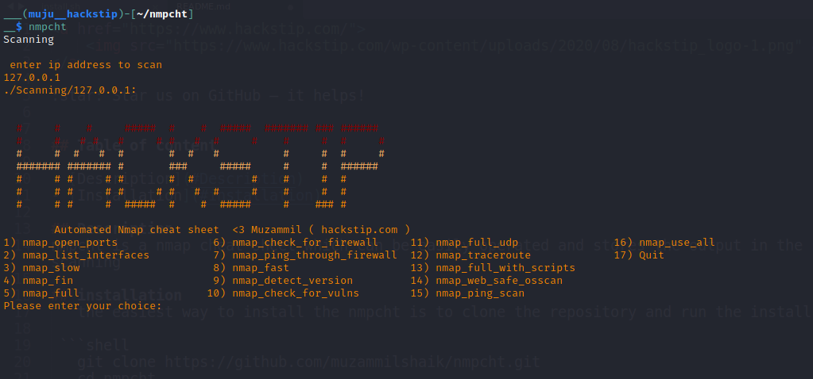

<a href="https://www.hackstip.com/">
    
</a>

:star: Star us on GitHub — it helps!


## Table of content

- [Description](#Description)
- [Installation](#installation)
- [Screen shots](#screenshot)
## Description
nmpcht is a nmap cheat sheet which can be easily operated and stores the output in the scanning directory according the host ip address provided for scanning 

## installation
   the easiest way to install the nmpcht is to clone the repository and run the install script 

 ```shell
 	git clone https://github.com/muzammilshaik/nmpcht.git 
 	cd nmpcht
 	./install.sh
 
 ```

## screenshot
   